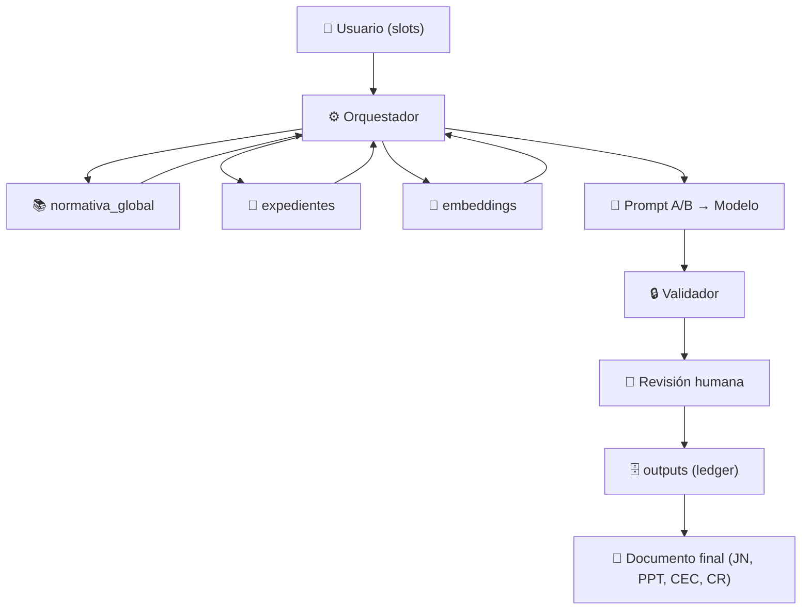

# 🗄️ Propuesta de estructura de Base de Datos en Mini-CELIA

En la documentación original del cliente (Mini-CELIA V1) se definen los prompts, el orquestador, el golden repo y el ledger de outputs, pero **no se especifica cómo organizar la base de datos** para gestionar normativa global, documentación particular y outputs generados.

Aquí presentamos una **arquitectura óptima en MongoDB**, alineada con los flujos del cliente, que nos permitirá:

- Diferenciar **normativa global** (aplicable a todas las licitaciones).  
- Manejar **documentación particular** (por expediente).  
- Recuperar información mediante **búsquedas semánticas (vectoriales)**.  
- Guardar de manera estructurada los **outputs (JSON A/B, narrativa)** con trazabilidad.

---

## 📚 Colecciones principales

### 1. `normativa_global`
- Contiene normativa estable (ej. RGPD, LCSP, cláusulas estándar).  
- Cada documento incluye metadatos: `id`, `titulo`, `version`, `hash`.  
- Se consulta cuando necesitamos **documento completo** o citas normativas.  

👉 Ejemplo: [ejemplos_json/normativa_global.json](ejemplos_json/normativa_global.json)

---

### 2. `expedientes`
- Documentación que sube el usuario para un expediente concreto.  
- Asociada a un `expediente_id`.  
- Incluye texto completo y metadatos.  

👉 Ejemplo: [ejemplos_json/expediente.json](ejemplos_json/expediente.json)

---

### 3. `embeddings`
- Fragmentos (chunks) de normativa global y expedientes, indexados con **vector search**.  
- Permiten recuperar fragmentos relevantes para cada Prompt A/B.  
- Referencian al documento original mediante `id_doc` y `expediente_id`.  

👉 Ejemplos:  
- [ejemplos_json/embedding_global.json](ejemplos_json/embedding_global.json)  
- [ejemplos_json/embedding_expediente.json](ejemplos_json/embedding_expediente.json)  

---

### 4. `outputs`
- Ledger donde se guardan los resultados generados por el modelo.  
- Contiene tanto **JSON_A (slots estructurados)** como **JSON_B (narrativa final)**.  
- Incluye `hash` y `citas_golden` para trazabilidad.  

👉 Ejemplos:  
- [ejemplos_json/output_jsonA.json](ejemplos_json/output_jsonA.json)  
- [ejemplos_json/output_jsonB.json](ejemplos_json/output_jsonB.json)  

---

## 🔄 Flujo de consulta e inserción

