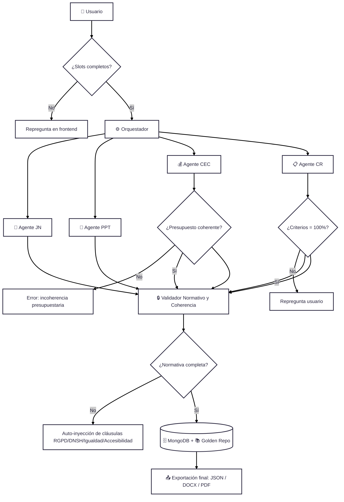

# 📑 Guía Operativa y Técnica – Flujo Enriquecido de Mini-CELIA

Este documento actúa como **guía central de referencia** para el equipo.  
Conecta la arquitectura multiagente con el **JSON canónico, validaciones, outputs, dependencias y errores comunes**, de forma que cualquier miembro pueda consultar el flujo en detalle y entender qué hace cada bloque.

---

## 1. Tabla de agentes y validaciones

| Agente        | Rol                                         | JSON campos principales                          | Validaciones                                       | Output                        | Posibles errores                          |
|---------------|---------------------------------------------|-------------------------------------------------|---------------------------------------------------|--------------------------------|-------------------------------------------|
| **JN**        | Redacta la Justificación de la Necesidad    | `objeto`, `contexto`, `plazo`, `presupuesto`    | `plazo > 0`, `objeto != vacío`                    | JSON JN + narrativa            | Slots incompletos → repregunta al usuario |
| **PPT**       | Define requisitos técnicos                  | `fases`, `metodología`, `entregables`           | –                                                 | JSON PPT                       | Entregables vacíos → warning              |
| **CEC**       | Calcula presupuesto                         | `pbl_base`, `iva_tipo`, `pbl_total`, `lotes`    | `pbl_total = pbl_base * (1+IVA)`                  | JSON CEC                       | Incoherencia presupuestaria → error       |
| **CR**        | Cuadro resumen administrativo               | Todos los anteriores                            | `criterios_adjudicacion = 100%`                   | JSON CR                        | Criterios ≠ 100% → repregunta             |
| **Validador** | Coherencia + normativa transversal          | Todos                                           | Inclusión de RGPD, DNSH, igualdad, accesibilidad  | Expediente validado y completo | Normativa faltante → auto-inyección       |

---

## 2. Dependencias entre documentos

- **JN → CEC**: el presupuesto indicado en la Justificación de la Necesidad debe coincidir con el del Cuadro Económico.  
- **JN → CR**: los plazos de ejecución definidos en la JN deben heredarse en el CR.  
- **PPT → CR**: las fases y entregables resumidos deben aparecer en el CR.  
- **CEC → CR**: los importes del CEC deben trasladarse íntegramente al CR.  

---

## 3. Errores comunes y resolución

- ❌ **Slots incompletos** → el frontend repregunta al usuario antes de continuar.  
- ❌ **Presupuesto incoherente** → el agente CEC devuelve error y bloquea la exportación hasta corregir.  
- ❌ **Criterios adjudicación ≠ 100%** → repregunta automática al usuario.  
- ❌ **Normativa faltante** → el Validador la inyecta automáticamente antes de guardar/exportar.  

---

## 4. Estrategia de escalado

- Este flujo detallado se ha trabajado sobre **JN** como ejemplo.  
- La misma lógica se aplicará de forma específica a:  
  - **PPT** → validaciones de fases/entregables.  
  - **CEC** → validaciones económicas.  
  - **CR** → coherencia administrativa.  
- La arquitectura multiagente permite añadir más documentos (ej. contratos de obras) sin romper la estructura.  

---

## 0. Diagrama de Flujo Enriquecido

---

## 📖 Glosario de bloques

- **Usuario 👤** → Introduce los datos iniciales (slots: objeto, presupuesto, plazos, criterios).  
- **Slots completos ✅** → Verificación de que todos los campos obligatorios tienen valor.  
  - ❌ Si no → el sistema repregunta.  
- **Orquestador ⚙️** → Controla el flujo y decide qué agente interviene y en qué orden.  
- **Agente JN 📄** → Redacta la Justificación de la Necesidad (narrativa legal).  
- **Agente PPT 📑** → Elabora el Pliego de Prescripciones Técnicas (requisitos, metodología).  
- **Agente CEC 💰** → Calcula el Cuadro Económico (presupuesto base, IVA, lotes).  
- **Agente CR 📋** → Compone el Cuadro Resumen (parte administrativa).  
- **Validación presupuesto 💰** → Revisa que `pbl_total = pbl_base + IVA`.  
- **Validación criterios 📊** → Comprueba que la suma de criterios de adjudicación sea = 100%.  
- **Validador normativo 🔒** → Asegura coherencia entre documentos y añade cláusulas obligatorias (RGPD, DNSH, igualdad, accesibilidad).  
  - ❌ Si falta normativa → la inyecta automáticamente.  
- **BBDD 🗄️ (MongoDB)** → Guarda expedientes en JSON estructurado.  
- **Golden Repo 📚** → Repositorio de normativa y plantillas tipo que alimenta a los agentes.  
- **Exportación 📤** → Genera la versión final en **DOCX, PDF y JSON**.  

---

## Guía técnica por bloques

- **Usuario**: Funcionario que prepara el expediente.  
- **Frontend React**: Interfaz donde introduce datos, puede ser wizard paso a paso o chat guiado.  
- **Orquestador (FastAPI + LangGraph)**:  
  - Controla el flujo del expediente.  
  - Decide qué agente se activa y en qué orden.  
  - Gestiona reintentos y fallos.  
- **Agente JN**: Redacta la justificación de la necesidad.  
- **Agente PPT**: Genera el pliego de prescripciones técnicas.  
- **Agente CEC**: Calcula presupuesto base, IVA y lotes.  
- **Agente CR**: Compila la información en el cuadro resumen.  
- **Validador**:  
  - Revisa que importes coincidan.  
  - Verifica que plazos sean coherentes.  
  - Garantiza que criterios de adjudicación suman 100%.  
  - Inyecta cláusulas normativas obligatorias (RGPD, DNSH, igualdad, accesibilidad).  
- **MongoDB + Golden Repo**:  
  - Guarda expedientes y versiones en JSON.  
  - Contiene normativa y expresiones tipo reutilizables.  
- **Exportación**: Entrega final en PDF, DOCX y JSON para integraciones.  