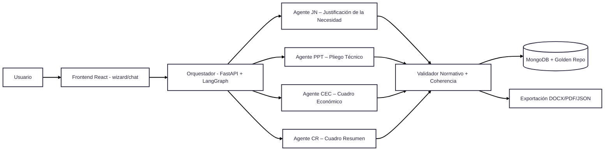

# 🌍 Esquema Global – Mini-CELIA (versión guía técnica – theme neutral)

---

## Guía técnica por bloques

- **Usuario**: Funcionario que prepara el expediente.  
- **Frontend React**: Interfaz donde introduce datos, puede ser wizard paso a paso o chat guiado.  
- **Orquestador (FastAPI + LangGraph)**:  
  - Controla el flujo del expediente.  
  - Decide qué agente se activa y en qué orden.  
  - Gestiona reintentos y fallos.  
- **Agente JN**: Redacta la justificación de la necesidad.  
- **Agente PPT**: Genera el pliego de prescripciones técnicas.  
- **Agente CEC**: Calcula presupuesto base, IVA y lotes.  
- **Agente CR**: Compila la información en el cuadro resumen.  
- **Validador**:  
  - Revisa que importes coincidan.  
  - Verifica que plazos sean coherentes.  
  - Garantiza que criterios de adjudicación suman 100%.  
  - Inyecta cláusulas normativas obligatorias (RGPD, DNSH, igualdad, accesibilidad).  
- **MongoDB + Golden Repo**:  
  - Guarda expedientes y versiones en JSON.  
  - Contiene normativa y expresiones tipo reutilizables.  
- **Exportación**: Entrega final en PDF, DOCX y JSON para integraciones.  
