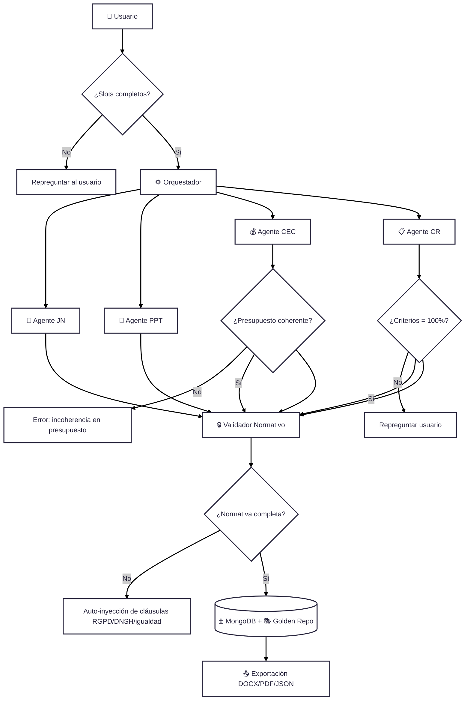

# 🌍 Esquema Global Enriquecido – Mini-CELIA

---

## 📖 Glosario de bloques

- **Usuario 👤** → Introduce los datos iniciales (slots: objeto, presupuesto, plazos, criterios).  
- **Slots completos ✅** → Verificación de que todos los campos obligatorios tienen valor.  
  - ❌ Si no → el sistema repregunta.  
- **Orquestador ⚙️** → Controla el flujo y decide qué agente interviene y en qué orden.  
- **Agente JN 📄** → Redacta la Justificación de la Necesidad (narrativa legal).  
- **Agente PPT 📑** → Elabora el Pliego de Prescripciones Técnicas (requisitos, metodología).  
- **Agente CEC 💰** → Calcula el Cuadro Económico (presupuesto base, IVA, lotes).  
- **Agente CR 📋** → Compone el Cuadro Resumen (parte administrativa).  
- **Validación presupuesto 💰** → Revisa que `pbl_total = pbl_base + IVA`.  
- **Validación criterios 📊** → Comprueba que la suma de criterios de adjudicación sea = 100%.  
- **Validador normativo 🔒** → Asegura coherencia entre documentos y añade cláusulas obligatorias (RGPD, DNSH, igualdad, accesibilidad).  
  - ❌ Si falta normativa → la inyecta automáticamente.  
- **BBDD 🗄️ (MongoDB)** → Guarda expedientes en JSON estructurado.  
- **Golden Repo 📚** → Repositorio de normativa y plantillas tipo que alimenta a los agentes.  
- **Exportación 📤** → Genera la versión final en **DOCX, PDF y JSON**.  

---
