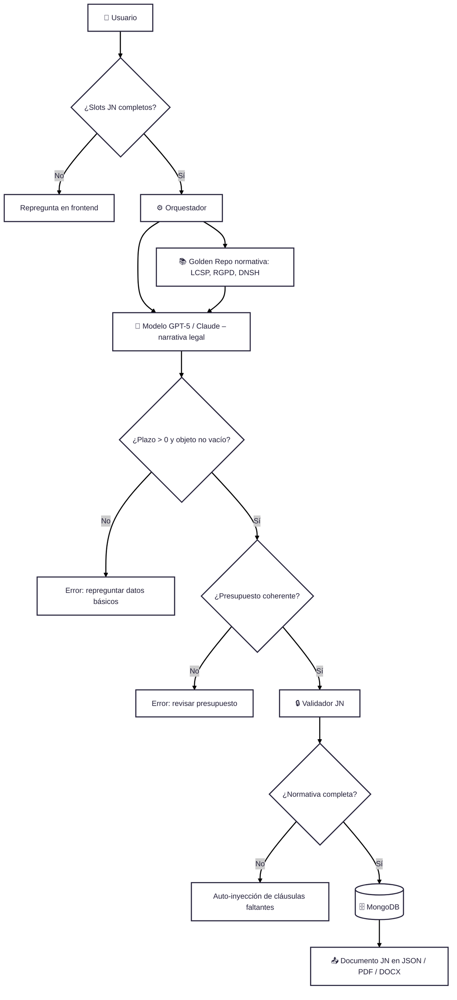

# 📑 Guía Operativa y Técnica – Flujo Enriquecido de la Justificación de la Necesidad (JN)

Este documento actúa como **guía de referencia específica** para la generación de la **Justificación de la Necesidad (JN)** dentro de Mini-CELIA.  
Conecta el flujo operativo con el **JSON canónico, validaciones, outputs, dependencias y errores comunes**, de forma que cualquier miembro pueda consultar el proceso en detalle.

---

## 1. Tabla de agentes y validaciones

| Agente        | Rol                                      | JSON campos principales                          | Validaciones                                       | Output              | Posibles errores                          |
|---------------|------------------------------------------|-------------------------------------------------|---------------------------------------------------|---------------------|-------------------------------------------|
| **Usuario**   | Proporciona la información inicial       | `objeto`, `contexto`, `plazo`, `presupuesto`    | Todos los campos obligatorios deben estar presentes | Slots validados     | Slots incompletos → repregunta en frontend |
| **Orquestador** | Coordina flujo entre modelo y normativa | –                                               | –                                                 | Slots procesados    | Falla conexión con modelo → reintento      |
| **Golden Repo** | Fuente normativa base                  | `normativa`                                     | Debe incluir RGPD, DNSH, igualdad, accesibilidad  | Normativa inyectada | Falta normativa → auto-inyección           |
| **Modelo**    | Genera narrativa legal                  | Slots + normativa                               | –                                                 | Narrativa JN        | Narrativa incompleta → reintento           |
| **Validador JN** | Comprueba coherencia y normativa      | `objeto`, `plazo`, `presupuesto`, `normativa`   | `plazo > 0`, `objeto != vacío`, `presupuesto > 0` | JN validado         | Incoherencias detectadas → corrección      |
| **MongoDB**   | Almacena el documento                   | Todos                                           | –                                                 | JSON JN persistente | Error de guardado → rollback               |
| **Exportador**| Genera salidas editables                | Todos                                           | –                                                 | JSON / DOCX / PDF   | Error exportación → reintento              |

---

## 2. Dependencias con otros documentos

- **JN → CEC**: el presupuesto definido en la JN debe coincidir con el que se use en el Cuadro Económico.  
- **JN → CR**: los plazos de ejecución definidos en la JN deben heredarse en el CR.  
- **JN → PPT**: el objeto y contexto de la JN sirven de base para definir fases y entregables en el PPT.  

---

## 3. Errores comunes y resolución

- ❌ **Slots incompletos** → el frontend repregunta al usuario antes de continuar.  
- ❌ **Objeto vacío o plazo ≤ 0** → error de validación, no se genera narrativa hasta corregir.  
- ❌ **Presupuesto incoherente** → bloquea exportación y repregunta valores.  
- ❌ **Normativa faltante** → el Validador inyecta automáticamente las cláusulas.  
- ❌ **Fallo de exportación** → se reintenta generar PDF/DOCX/JSON.  

---

## 4. Estrategia de escalado

- Este flujo detallado de JN sirve como **plantilla** para el resto de documentos.  
- En cada caso se añaden validaciones específicas:  
  - **PPT** → fases, entregables y metodología.  
  - **CEC** → cálculos económicos y coherencia presupuestaria.  
  - **CR** → coherencia administrativa y criterios de adjudicación.  

---

## 0. Diagrama de Flujo Enriquecido JN


## 📖 Glosario de bloques

- **Usuario 👤** → Introduce los datos de la JN (objeto, contexto, presupuesto, plazo).  
- **Slots JN completos ✅** → Revisión de que los campos mínimos estén rellenos.  
  - ❌ Si falta → repregunta al usuario.  
- **Orquestador ⚙️** → Coordina el flujo hacia modelo y normativa.  
- **Golden Repo 📚** → Repositorio normativo (LCSP, RGPD, DNSH, igualdad, accesibilidad).  
- **Modelo 🤖** → Genera la narrativa legal de la JN en base a slots + normativa.  
- **Validación plazo/objeto** → Revisa que `plazo > 0` y `objeto` no esté vacío.  
- **Validación presupuesto** → Comprueba coherencia entre presupuesto y slots.  
- **Validador JN 🔒** → Chequea normativa y coherencia antes de guardar.  
- **Auto-inyección 🔄** → Si falta normativa, el sistema la añade automáticamente.  
- **MongoDB 🗄️** → Guarda el documento en JSON estructurado.  
- **Exportación 📤** → Genera los documentos finales (JSON, PDF, DOCX).  

---

## Guía técnica por bloques

- **Slots JN**: Información estructurada capturada en frontend (objeto, presupuesto, plazos).  
- **Orquestador**: Coordina flujo hacia modelo y normativa.  
- **Golden Repo**: Repositorio normativo centralizado (LCSP, RGPD, DNSH, igualdad, accesibilidad).  
- **Modelo**: LLM generador de narrativa legal (GPT-5 o Claude).  
- **Validador**: Reglas deterministas + modelo ligero para coherencia (plazos > 0, importes coherentes, normativa presente).  
- **MongoDB**: Guarda versión estructurada del documento y su narrativa.  
- **Exportación**: Entrega documento en varios formatos (JSON, PDF, DOCX). 


```mermaid


flowchart TD
    U["👤 Usuario: datos/slots"] --> OR["⚙️ Orquestador"]

    OR --> DB1["📚 normativa_global (colección documental)"]
    OR --> DB2["📂 expedientes (documentos particulares)"]
    OR --> DB3["🧠 embeddings (vectorial para RAG)"]

    DB1 --> OR
    DB2 --> OR
    DB3 --> OR

    OR --> P["🧠 Prompt A/B → Modelo (JSON / narrativa)"]

    P --> VL["🔒 Validador"]
    VL --> RH["👀 Revisión humana"]
    RH --> OUTS["🗄️ outputs/ledger (JSON_A, JSON_B)"]

    OUTS --> EN["📄 Documento final (JN, PPT, CEC, CR)"]


