# 🔍 Zoom – Generación de la Justificación de la Necesidad (JN) (theme neutral)

```mermaid
%%{init: {'theme':'redux'}}%%
flowchart TD
    U[Usuario] --> S[Slots JN: objeto, contexto, presupuesto, plazo]
    S --> O[Orquestador]
    O --> G[Golden Repo normativa: LCSP, RGPD, DNSH]
    O --> M[Modelo GPT-5 / Claude – narrativa legal]
    G --> M
    M --> V[Validador JN – reglas + modelo ligero]
    V --> DB[(MongoDB)]
    V --> OUT[Documento JN en JSON / PDF / DOCX]
```

---

## Guía técnica

- **Slots JN**: Información estructurada capturada en frontend (objeto, presupuesto, plazos).  
- **Orquestador**: Coordina flujo hacia modelo y normativa.  
- **Golden Repo**: Repositorio normativo centralizado (LCSP, RGPD, DNSH, igualdad, accesibilidad).  
- **Modelo**: LLM generador de narrativa legal (GPT-5 o Claude).  
- **Validador**: Reglas deterministas + modelo ligero para coherencia (plazos > 0, importes coherentes, normativa presente).  
- **MongoDB**: Guarda versión estructurada del documento y su narrativa.  
- **Exportación**: Entrega documento en varios formatos (JSON, PDF, DOCX).  
