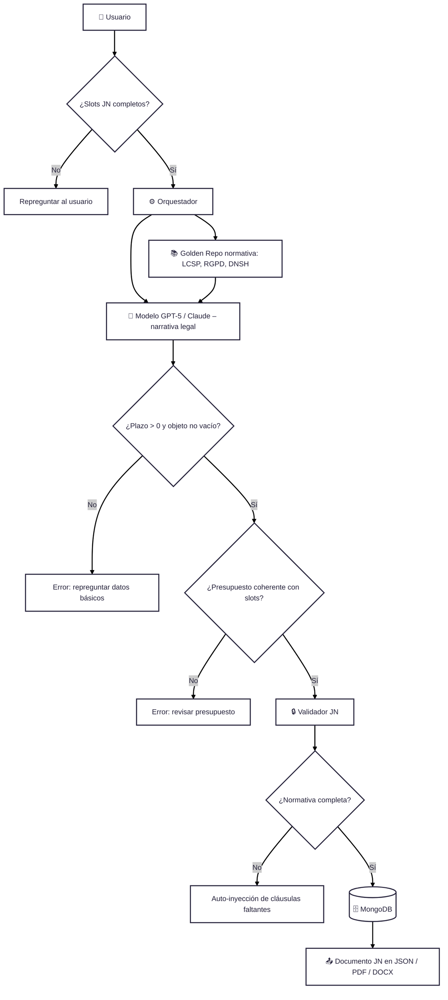

# 🔍 Zoom Enriquecido – Generación de la Justificación de la Necesidad (JN)

## 📖 Glosario de bloques

- **Usuario 👤** → Introduce los datos de la JN (objeto, contexto, presupuesto, plazo).  
- **Slots JN completos ✅** → Revisión de que los campos mínimos estén rellenos.  
  - ❌ Si falta → repregunta al usuario.  
- **Orquestador ⚙️** → Coordina el flujo hacia modelo y normativa.  
- **Golden Repo 📚** → Repositorio normativo (LCSP, RGPD, DNSH, igualdad, accesibilidad).  
- **Modelo 🤖** → Genera la narrativa legal de la JN en base a slots + normativa.  
- **Validación plazo/objeto** → Revisa que `plazo > 0` y `objeto` no esté vacío.  
- **Validación presupuesto** → Comprueba coherencia entre presupuesto y slots.  
- **Validador JN 🔒** → Chequea normativa y coherencia antes de guardar.  
- **Auto-inyección 🔄** → Si falta normativa, el sistema la añade automáticamente.  
- **MongoDB 🗄️** → Guarda el documento en JSON estructurado.  
- **Exportación 📤** → Genera los documentos finales (JSON, PDF, DOCX).  
