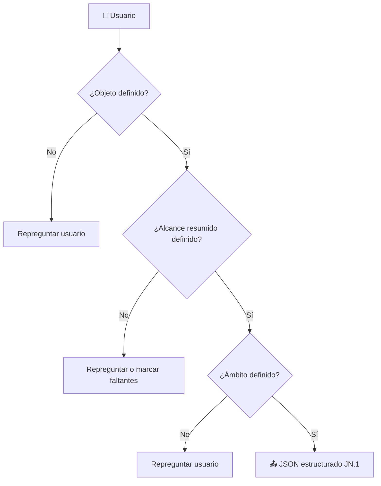

# 📑 Guía Operativa – JN.1 Objeto y Alcance

Esta sección define de forma clara el **Objeto y Alcance del contrato**, estableciendo:
- Qué se contrata (objeto).
- Qué actividades o servicios cubre (alcance resumido).
- Dónde aplica (ámbito).

---

## 1. Campos JSON y validaciones

| Campo JSON          | Descripción                                      | Validación                       | Error posible       | Acción del sistema   |
|---------------------|--------------------------------------------------|----------------------------------|---------------------|----------------------|
| `objeto`            | Descripción del objeto de la licitación           | No vacío, longitud > 10 caracteres | Campo vacío/corto   | Repreguntar usuario |
| `alcance_resumido`  | Resumen de actividades o servicios incluidos      | No vacío                         | Campo vacío         | Repreguntar usuario |
| `ambito`            | Ámbito geográfico o institucional de aplicación   | No vacío                         | Campo vacío         | Repreguntar usuario |

---

## 2. Dependencias con otros documentos

- **JN.1 → PPT**: el objeto alimenta la definición de fases y entregables.  
- **JN.1 → CR**: el objeto y ámbito se incluyen en el resumen administrativo.  

---

## 3. Errores comunes y resolución

- ❌ **Objeto vacío o muy genérico** → repreguntar antes de avanzar.  
- ❌ **Alcance resumido ausente** → marcar en `faltantes[]`.  
- ❌ **Ámbito no definido** → repreguntar usuario.  

---

## 4. Diagrama de flujo – JN.1


---

## 5. Ejemplo práctico

### Entrada usuario
"Queremos contratar el suministro de equipos informáticos 
para renovar el parque de ordenadores de la administración local. 
El contrato incluye la adquisición, instalación y configuración inicial. 
Se aplicará en los edificios municipales del Ayuntamiento..."

### JSON_A (estructurado)
```json
{
  "schema_version": "1.0.0",
  "doc": "JN",
  "seccion": "JN.1",
  "expediente_id": "EXP-AYTO-2025-001",
  "nodo": "A",
  "timestamp": "2025-09-25T09:30:00Z",
  "actor": "G",
  "proveniencia": "A(JSON) desde UI",
  "data": {
    "objeto": "Contratación del suministro de equipos informáticos para la renovación del parque de ordenadores de la administración local.",
    "alcance_resumido": "Incluye adquisición, instalación y configuración inicial de los equipos.",
    "ambito": "Edificios municipales del Ayuntamiento"
  },
  "citas_golden": [],
  "citas_normativas": [],
  "faltantes": [],
  "alertas": [],
  "dependencias": [],
  "score_local": { "estructura": 1, "cumplimiento": 1, "narrativa": 0 }
}
```

### JSON_B (estructurado)

```json

{
  "schema_version": "1.0.0",
  "doc": "JN",
  "seccion": "JN.1",
  "expediente_id": "EXP-AYTO-2025-001",
  "nodo": "B",
  "timestamp": "2025-09-25T09:31:00Z",
  "actor": "G",
  "proveniencia": "B(narrativa) a partir de JSON A validado",
  "refs": {
    "hash_json_A": "hash_A_JN1",
    "citas_golden": [],
    "citas_normativas": []
  },
  "render_options": {
    "modo": "con_titulos",
    "estilo_listas": "parrafos",
    "tono": "administrativo neutro",
    "max_chars": 900
  },
  "narrativa": {
    "outline": ["Objeto y Alcance"],
    "texto": "El objeto del expediente es la contratación del suministro de equipos informáticos con el fin de renovar el parque de ordenadores de la administración local. El alcance del contrato comprende la adquisición, instalación y configuración inicial de los equipos. El ámbito de aplicación son los edificios municipales del Ayuntamiento.",
    "placeholders": []
  },
  "calidad": {
    "score_local": { "narrativa": 1.0 },
    "warnings": []
  },
  "control_llm": {
    "model": "GPT-5",
    "temperature": 0.2,
    "tokens_prompt": 0,
    "tokens_completion": 0,
    "stop_reason": "stop"
  }
}


